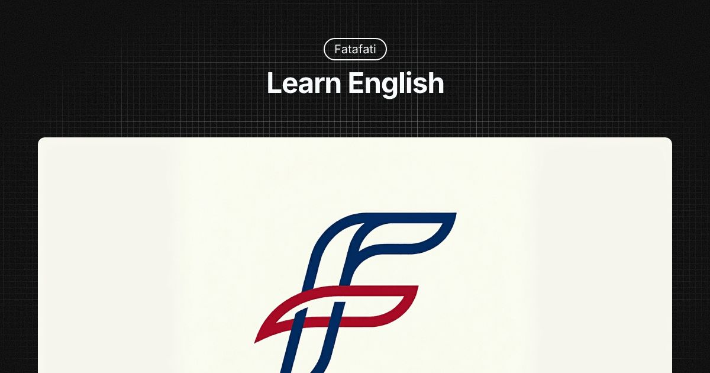

<p align="center">
  
</p>

<h1 align="center">ফাটাফাটি — Fatafati</h1>
<p align="center">A structured, self-paced English learning web app for Bengali speakers in West Bengal and Bangladesh.</p>

<p align="center">
  
  <a href="https://fatafati.openworldregister.com">fatafati.openworldregister.com</a>
</p>

---

## What it is

Fatafati guides learners through a milestone-based English curriculum — from basics to fluency — entirely in Bengali. No app store needed, works offline as a PWA.

## How it works

1. Browse topics organised into milestones on the Learn page
2. Read the lesson for each topic
3. Pass a 10-question quiz to unlock the next topic
4. Complete all topics in a milestone → pass the milestone test → level up

## Pages

| File | Purpose |
|---|---|
| `index.html` | Homepage |
| `learn.html` | Full curriculum browser |
| `topic.html` | Individual lesson + quiz |
| `profile.html` | User progress dashboard |
| `admin.html` | Content management (admin only) |

## Tech stack

- Vanilla HTML, CSS, JavaScript — no framework
- [Supabase](https://supabase.com) for auth and database
- Google Fonts — Noto Serif Bengali + Hind Siliguri
- Font Awesome icons
- PWA with service worker (`sw.js`) for offline support

## Local development

Just open `index.html` in a browser or serve with any static file server:

```bash
npx serve .
```

Set your Supabase project URL and anon key in `js/supabase-client.js`.

## Assets

| Asset | Path |
|---|---|
| Logo | `assets/logo.png` |
| Favicon | `assets/icons/favicon.ico` |
| SVG icon | `assets/icons/favicon.svg` |
| PWA icons | `assets/icons/icon-192.png`, `icon-512.png` |
| OG image | `assets/og/og-default.jpg` |

<p align="center">
  
</p>

---

<p align="center">© 2026 Fatafati</p>
